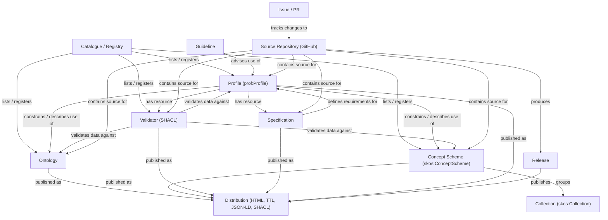

```mermaid
graph TD

%% -----------------------
%% Core governance layer
%% -----------------------

Catalogue["Catalogue / Registry"]
Profile["Profile (prof:Profile)"]
Specification["Specification"]
Guideline["Guideline"]
Validator["Validator (SHACL)"]

%% -----------------------
%% Semantic artefacts
%% -----------------------

Ontology["Ontology"]
ConceptScheme["Concept Scheme (skos:ConceptScheme)"]
Collection["Collection (skos:Collection)"]

%% -----------------------
%% Publication layer
%% -----------------------

Distribution["Distribution (HTML, TTL, JSON-LD, SHACL)"]

%% -----------------------
%% Operational layer
%% -----------------------

Repository["Source Repository (GitHub)"]
Release["Release"]
Issue["Issue / PR"]

%% -----------------------
%% Relationships
%% -----------------------

Catalogue -->|lists / registers| Profile
Catalogue -->|lists / registers| Ontology
Catalogue -->|lists / registers| ConceptScheme
Catalogue -->|lists / registers| Validator

Profile -->|has resource| Specification
Profile -->|has resource| Validator
Profile -->|constrains / describes use of| Ontology
Profile -->|constrains / describes use of| ConceptScheme

Specification -->|defines requirements for| Profile
Guideline -->|advises use of| Profile

Validator -->|validates data against| Profile
Validator -->|validates data against| Ontology
Validator -->|validates data against| ConceptScheme

ConceptScheme -->|groups| Collection

Ontology -->|published as| Distribution
ConceptScheme -->|published as| Distribution
Validator -->|published as| Distribution
Specification -->|published as| Distribution
Profile -->|published as| Distribution

Repository -->|contains source for| Ontology
Repository -->|contains source for| ConceptScheme
Repository -->|contains source for| Validator
Repository -->|contains source for| Specification
Repository -->|contains source for| Profile

Repository -->|produces| Release
Release -->|publishes| Distribution

Issue -->|tracks changes to| Repository
```
